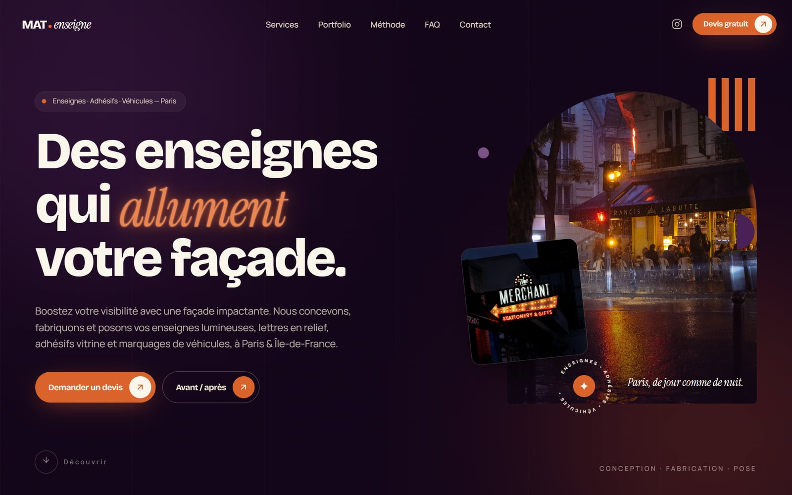
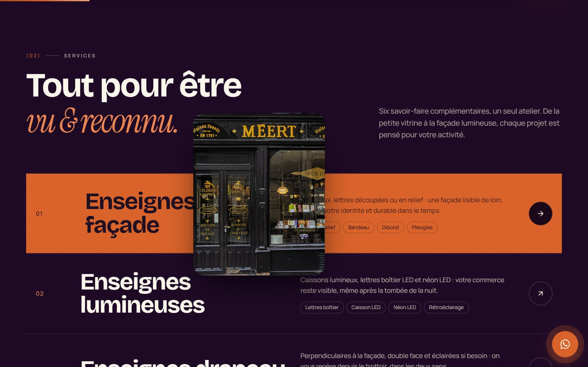
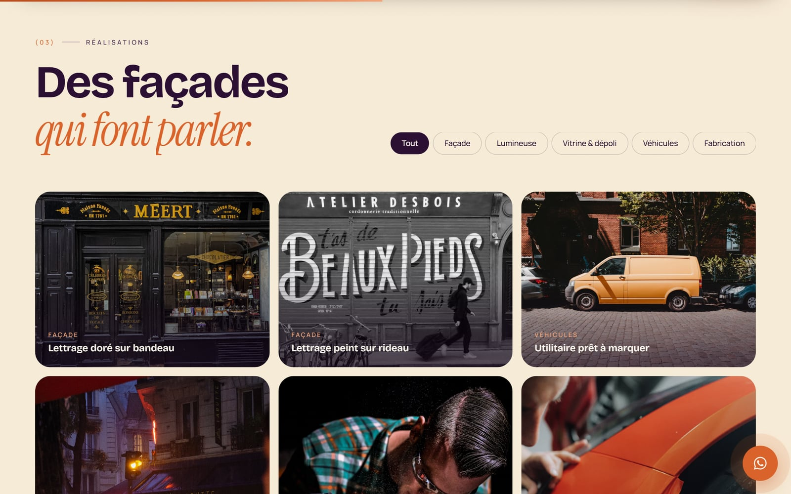
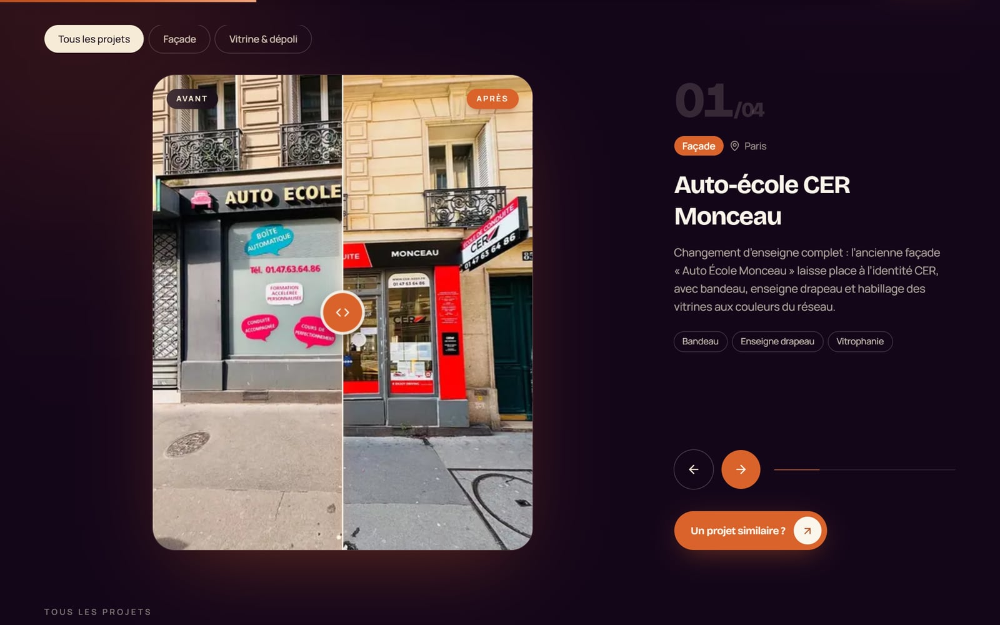
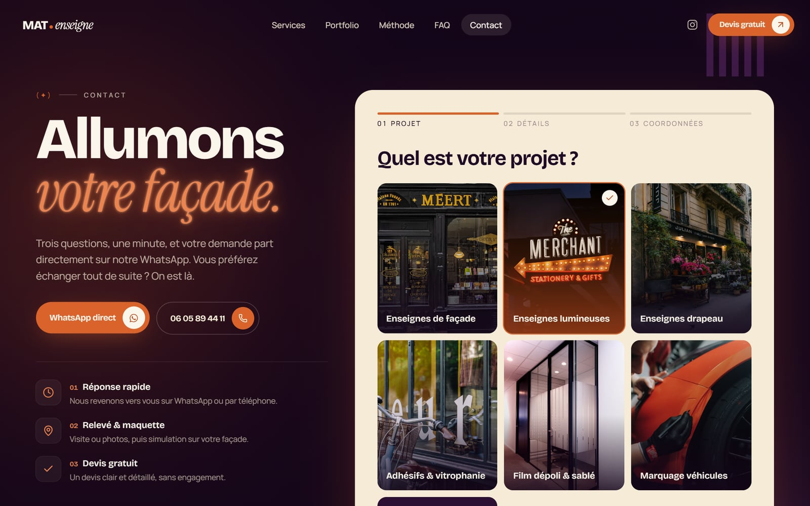
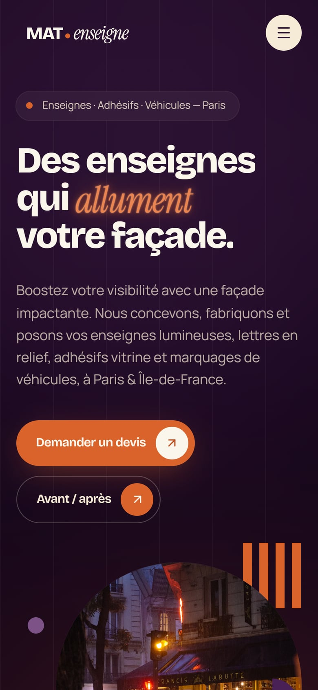
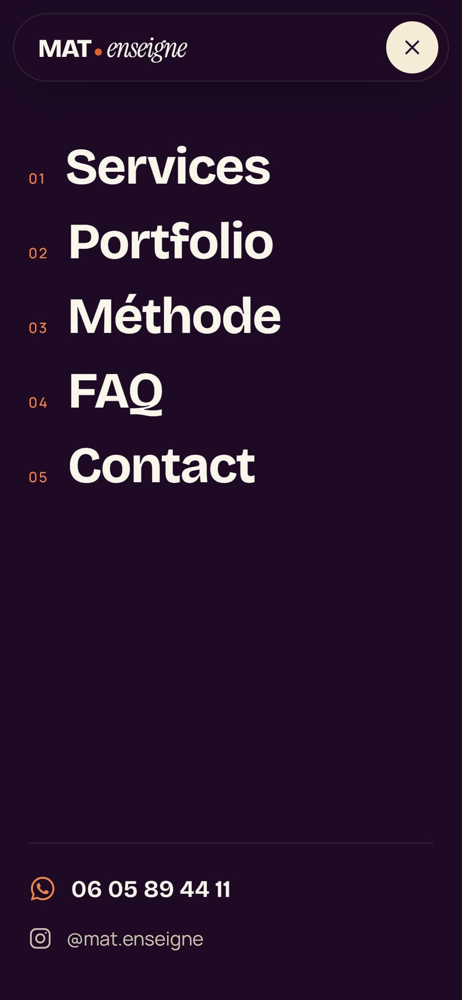
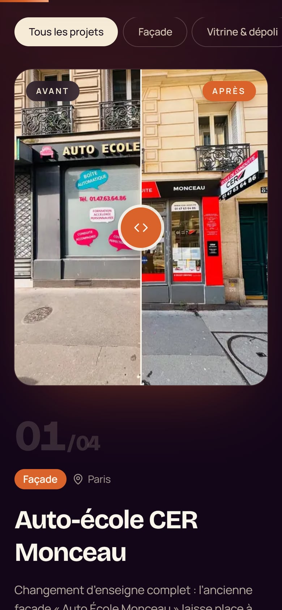
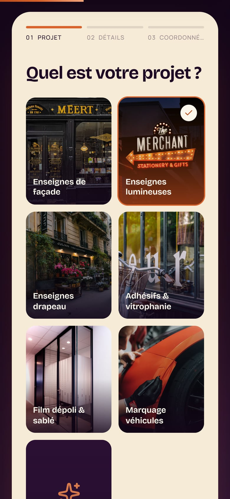

<div align="center">

# Mat Enseigne

**Showcase website for a Paris-based sign maker: shopfront signs, illuminated signs, window graphics and vehicle lettering.**


<br />



</div>

## Overview

A fast, animated, fully responsive single-page application built for **Mat Enseigne**, a sign-making business in Paris & Île-de-France. It presents the company's services, showcases real projects through an interactive before/after slider, and walks visitors through a quote request. It is published as a portfolio showcase, so the forms are demos and send nothing.

The design system is built around a three-colour palette (cream, aubergine and ember) with Bauhaus-inspired shapes and "neon sign" effects that echo the trade.

## Screenshots

### Desktop

<table>
  <tr>
    <td width="50%"></td>
    <td width="50%"></td>
  </tr>
  <tr>
    <td align="center"><sub>Services with a cursor-following preview</sub></td>
    <td align="center"><sub>Filterable project gallery</sub></td>
  </tr>
  <tr>
    <td width="50%"></td>
    <td width="50%"></td>
  </tr>
  <tr>
    <td align="center"><sub>Before/after portfolio</sub></td>
    <td align="center"><sub>Three-step quote wizard</sub></td>
  </tr>
</table>

### Mobile

<table>
  <tr>
    <td width="25%"></td>
    <td width="25%"></td>
    <td width="25%"></td>
    <td width="25%"></td>
  </tr>
  <tr>
    <td align="center"><sub>Home</sub></td>
    <td align="center"><sub>Menu</sub></td>
    <td align="center"><sub>Portfolio</sub></td>
    <td align="center"><sub>Quote wizard</sub></td>
  </tr>
</table>

## Features

- **Before/after slider.** Drag with a mouse or finger, or use the keyboard, to reveal the result. It runs on GPU transforms only, holding 60 fps even with the CPU throttled 4×.
- **Quote forms (demo).** A quick form and a three-step wizard with full validation. On submit they show a confirmation, and nothing is sent or stored.
- **Spam protection without a backend.** A honeypot field, a minimum fill time, a link-spam filter, per-browser rate limiting and input sanitising.
- **Motion design.** Smooth scrolling, a pinned horizontal timeline, a scroll-driven reveal, split-text headings, magnetic buttons and page-transition curtains.
- **Responsive and accessible.** Tested from 320 px to 1920 px, with keyboard support, focus management, ARIA labelling and full `prefers-reduced-motion` support.
- **Performance.** Responsive WebP images in two sizes, a preloaded LCP image, lazy-loaded routes and self-hosted fonts.
- **SEO.** Per-page meta tags, Open Graph and Twitter cards, `LocalBusiness` JSON-LD, and a sitemap and `robots.txt` generated at build time.
- **Security.** A strict Content-Security-Policy, HSTS and the standard security headers. There are no third-party scripts and no cookies.

## Tech stack

| Area               | Tools                                         |
| ------------------ | --------------------------------------------- |
| Runtime & packages | [Bun](https://bun.sh)                         |
| Framework          | React 19, TypeScript (strict), Vite 8         |
| Styling            | Tailwind CSS 4 with design tokens             |
| Animation          | Motion, Lenis                                 |
| Routing            | React Router (data router, lazy routes)       |
| Forms              | React Hook Form, Zod                          |
| Quality            | Biome (lint and format), Vitest               |
| Images             | Sharp (build-time image pipeline)             |
| Hosting            | Vercel                                        |

## Getting started

**Prerequisite:** [Bun](https://bun.sh) 1.3 or later.

```bash
git clone https://github.com/Alaa-Younsi/Mat-Enseigne.git
cd Mat-Enseigne
bun install
bun run dev
```

The site runs at <http://localhost:5173>.

### Scripts

| Command             | Description                                      |
| ------------------- | ------------------------------------------------ |
| `bun run dev`       | Start the development server                     |
| `bun run build`     | Type-check and build for production into `dist/` |
| `bun run preview`   | Serve the production build locally               |
| `bun run typecheck` | Run the TypeScript compiler                      |
| `bun run lint`      | Lint and check formatting with Biome             |
| `bun run lint:fix`  | Apply safe lint and formatting fixes             |
| `bun run test`      | Run the unit tests                               |
| `bun run images`    | Optimise the portfolio before/after photos       |

### Environment variables

| Variable        | Required | Description                                                                           |
| --------------- | -------- | ------------------------------------------------------------------------------------- |
| `VITE_SITE_URL` | No       | Canonical URL with no trailing slash, used for SEO tags, the sitemap and `robots.txt` |

Copy `.env.example` to `.env.local` to set it locally.

## Project structure

```
├─ docs/screenshots/        README screenshots
├─ portfolio-originals/     Raw before/after photos (git-ignored)
├─ public/images/           Optimised WebP images (800 and 1600 px)
├─ scripts/                 Build-time image pipeline
└─ src/
   ├─ components/
   │  ├─ layout/            Header, footer, page transitions, smooth scroll
   │  └─ ui/                Reusable UI: slider, buttons, reveals, lightbox…
   ├─ config/site.ts        Business details (name, area, Instagram)
   ├─ data/                 All page content: services, projects, FAQ…
   ├─ hooks/                Scrolling, navigation, page meta, form submission
   ├─ lib/                  Spam guard (with tests)
   ├─ pages/                Home, Portfolio, Contact, Legal notice, 404
   ├─ sections/             Home page sections
   └─ styles/globals.css    Design tokens and global styles
```

## Managing content

**Text and business details** are kept apart from the components:

- `src/config/site.ts` holds the business name, Instagram and service area.
- `src/data/` holds the services, gallery, process steps and FAQ.

**Adding a before/after project:**

1. Create a folder in `portfolio-originals/` named in lowercase with dashes, for example `boulangerie-paris-11/`. Put two photos in it, `avant.jpg` and `apres.jpg`.
2. Run `bun run images`. The script corrects photo orientation and crops both photos to the same framing. It exports optimised WebP files and never upscales small photos.
3. Add an entry to `src/data/portfolio.ts` with the same slug. The first entry is also featured on the home page.

## Deployment

The project is set up for [Vercel](https://vercel.com) with no extra configuration:

1. Import the repository into Vercel. It detects Bun from `bun.lock`, and `vercel.json` provides the build settings, SPA rewrites, caching rules and security headers.
2. Add `VITE_SITE_URL` under **Settings → Environment Variables**.
3. Deploy, then connect the custom domain.

## Credits

Some illustrative photography is from [Unsplash](https://unsplash.com) (Unsplash License). The portfolio photos show projects by Mat Enseigne.

## License

**© 2026 Alaa Younsi. All rights reserved.**

This code is proprietary. It is publicly visible for viewing only. No part of it may be used, copied, modified, distributed or reused in any form without prior written permission. See [LICENSE](LICENSE) for the full terms.
